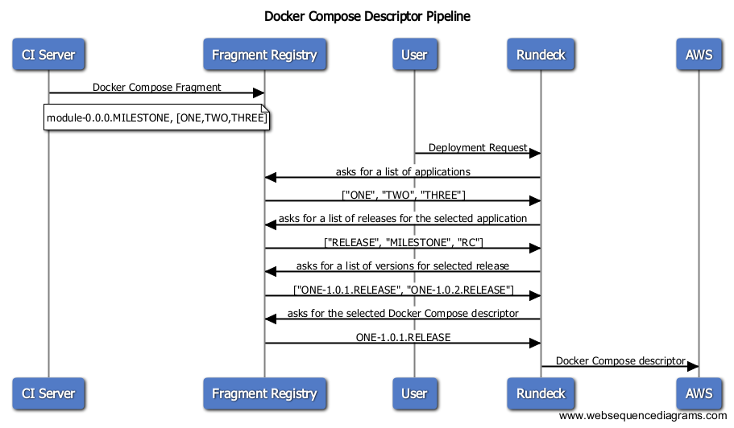

# Overview
This project is a simple service that manages Docker Compose fragments from 
individual projects, assembling them into a single descriptor.  The intent 
is that CI servers will publish fragments at the end of a successful build 
and that deployment tools, such as [Rundeck](http://rundeck.org/), will 
use the descriptor to publish to a scheduler that understand Docker Compose
files, such as [AWS ECS](https://aws.amazon.com/ecs/).

# Prerequisites

* [JDK 8](http://www.oracle.com/technetwork/java/index.html) installed and working
* Building under [Ubuntu Linux](http://www.ubuntu.com/) is supported and recommended 

# Building
Type `./gradlew` to build and assemble the service.

# Installation
TODO

# Tips and Tricks

## Verifying The Setup
TODO

## Running Integration Tests From Gradle
TODO

## Running Acceptance Tests From Gradle
TODO

## Running Acceptance Tests From IDEA
TODO

## Operations Endpoints
The services supports a variety of endpoints useful to an Operations engineer.

* /operations - Provides a hypermedia-based “discovery page” for the other endpoints.
* /operations/autoconfig - Displays an auto-configuration report showing all auto-configuration candidates and the reason why they ‘were’ or ‘were not’ applied.
* /operations/beans - Displays a complete list of all the Spring beans in your application.
* /operations/configprops - Displays a collated list of all `@ConfigurationProperties`.
* /operations/dump - Performs a thread dump.
* /operations/env - Exposes properties from Spring’s `ConfigurableEnvironment`.
* /operations/flyway - Shows any `Flyway` database migrations that have been applied.
* /operations/health - Shows application health information.
* /operations/info - Displays arbitrary application info.
* /operations/liquibase - Shows any `Liquibase` database migrations that have been applied.
* /operations/logfile - Returns the contents of the logfile (if logging.file or logging.path properties have been set).
* /operations/metrics - Shows ‘metrics’ information for the current application.
* /operations/mappings - Displays a collated list of all `@RequestMapping` paths.
* /operations/shutdown - Allows the application to be gracefully shutdown (not enabled by default).
* /operations/trace - Displays trace information (by default the last few HTTP requests).

## REST API Documentation
You can find the current API documentation at `/docs/index.hml`.

# Troubleshooting

TODO

# License and Credits
This project is licensed under the [Apache License Version 2.0, January 2004](http://www.apache.org/licenses/).

# List of Changes

